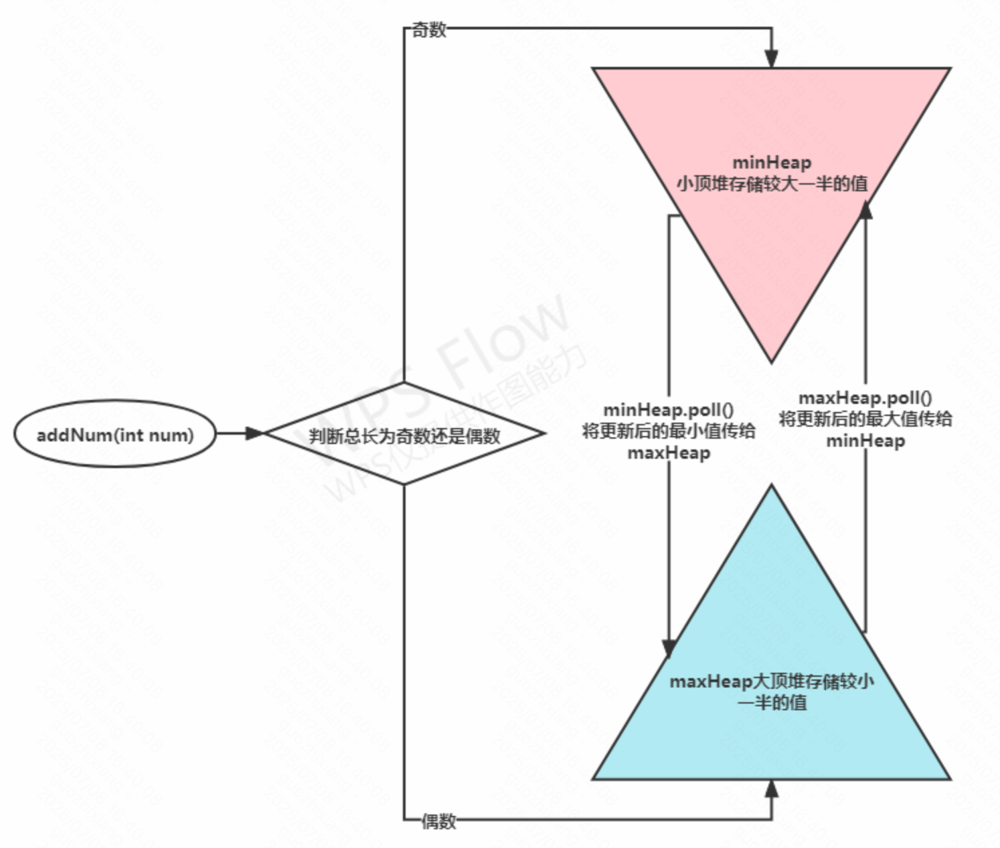

# 优先队列「堆」

思想：底层用堆 自动排序好 使得peek min or max

场景：TopK 、数据流排序

<details class="lake-collapse"><summary id="u8c6459d8"><span class="ne-text">板子</span></summary><pre data-language="java" id="XoxPq" class="ne-codeblock language-java" style="border: 1px solid #e8e8e8; border-radius: 2px; background: #f9f9f9; padding: 16px; font-size: 13px; color: #595959"><code>PriorityQueue&lt;Integer&gt; pq = new PriorityQueue&lt;&gt;();//默认最小堆

PriorityQueue&lt;Integer&gt; pq = new PriorityQueue&lt;&gt;(o2 - o1);//默认最小堆</code></pre></details>


[215. 数组中的第K个最大元素](https://leetcode.cn/problems/kth-largest-element-in-an-array/) - 板子题 「cur>peek 就弹出 ：即peek得是最小那个 **后续不可能成为topk 所以用最小堆**」

如果用大堆，就得保存 n 个元素（因为你 poll 那个是 max 得遍历 all 才可以找到 poll 哪个


[347. 前 K 个高频元素](https://leetcode.cn/problems/top-k-frequent-elements/) - 板子题+自定义规则 「实现下根据次数排序的Compare规则即可 

```java
PriorityQueue<Map.Entry<Integer, Integer>>
pq = new PriorityQueue<>((entry1, entry2) -> {
    return entry1.getValue()- entry2.getValue();
});
```

[LCR 160. 数据流中的中位数](https://leetcode.cn/problems/shu-ju-liu-zhong-de-zhong-wei-shu-lcof/) - 说白了就是偶数取两个、奇数取小堆 「和放入逻辑有关系，偶数时加入下面排序再放上去

图解：

