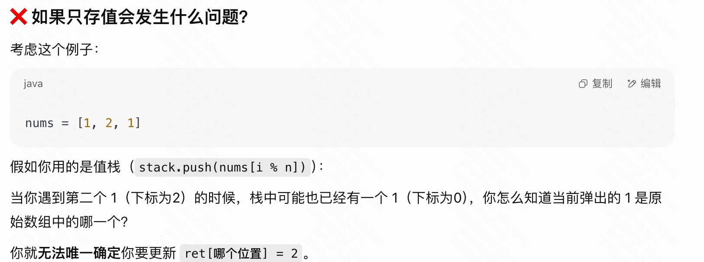
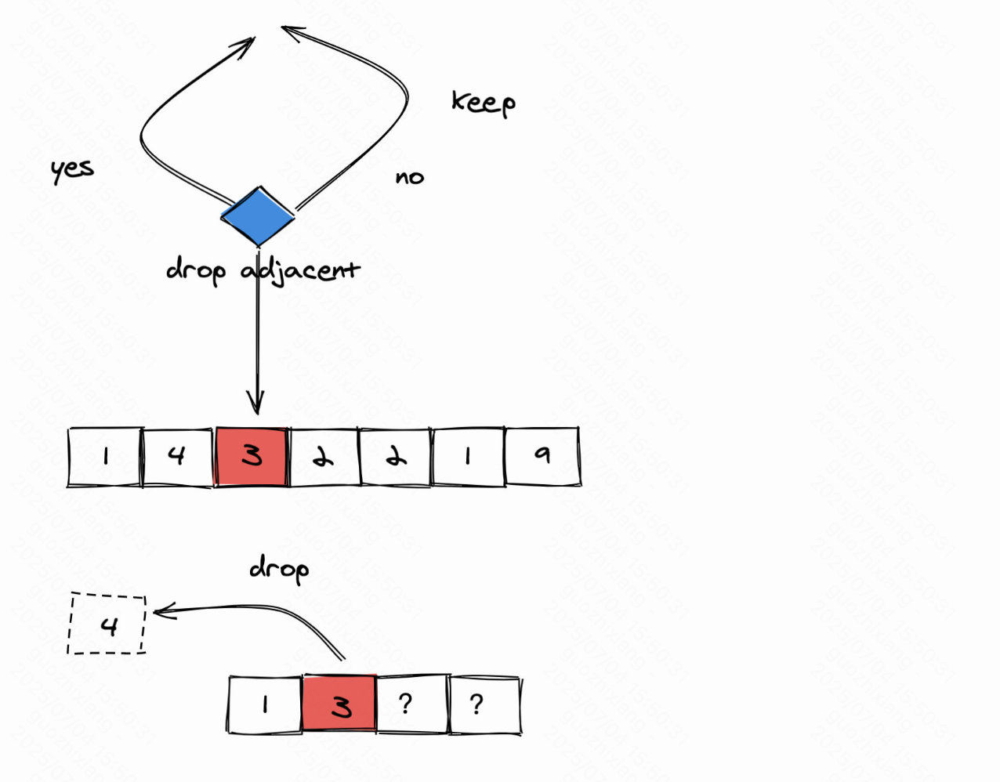
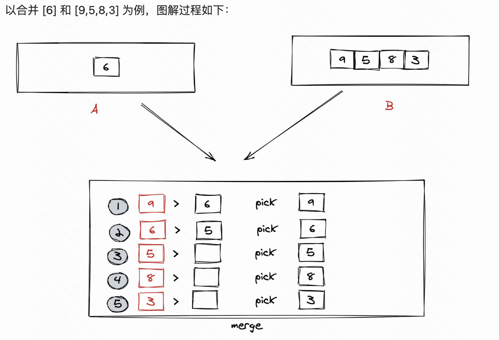

# 单调栈

思想：

场景：求此元素 前/后 的第一个 大or小（index，value）、删除使得max min

模板

```Java
Deque<Integer> st = new ArrayDeque<>();
for (int i = 0; i < n; i++) {//for 加入的元素
    int cur = //当前的
    while (!st.isEmpty() && cur > 栈顶) {
        //弹出逻辑 + 记录答案
    }
    //插入逻辑 + 记录答案
    注意存什么
}

存 例子：dailyTemperatures(int[] temperatures) {
    for (int i = 0; i < n; i++) {
        int cur = temperatures[i];
        while (!st.isEmpty() && cur > temperatures[st.peek()]) {
            int j = st.pop();
            ans[j] = i - j;
        }
        st.push(i);//存的是下标 因为要间隔
    }
}

//（左：插入）左第一大 :   cur < peek_A  不就是插入的逻辑      | 左第一个小 : 不就是cur > peek_A  不就是插入的逻辑(同理的
//（右：把它弹）右边第一大 : cur > peek_A    不就是写弹出逻辑
```

## 基础

[739. 每日温度](https://leetcode.cn/problems/daily-temperatures/)  我

右：弹出 ，大 cur>peek

记录：索引

for index

​    单调栈逻辑

​    	弹出：int last dailyIndex = 

​        	int diff = cur - i

[496. 下一个更大元素 I](https://leetcode.cn/problems/next-greater-element-i/) - 写到弹出逻辑 记录kv即可

[503. 下一个更大元素 II](https://leetcode.cn/problems/next-greater-element-ii/) - 循环数组了 多个循环两次逻辑「后续取模」

找到栈顶那个元素的“下一个更大元素”（`cur`），然后 **在** `**ret**` **数组的相应位置** 填入这个更大值

你要把“谁”的结果更新到 `ret` 里？如果你只存“值”，你就**无法知道这个值原本是在哪个位置的**，从而也**无法更新** `**ret[?]**` **的那个位置**。



1475. 商品折扣后的最终价格 非暴力做法
1476. 股票价格跨度 1709
1477. 车队

## 删除特定类

[402. 移掉 K 位数字](https://leetcode.cn/problems/remove-k-digits/) - 「数字可删次数 需不需要删逻辑」

14.. 3 -> 13..(高位搞小点

[316. 去除重复字母](https://leetcode.cn/problems/remove-duplicate-letters/) - 移除次数动态「记录每个字符可删次数」 [1081. 不同字符的最小子序列](https://leetcode.cn/problems/smallest-subsequence-of-distinct-characters/) 同样的


[321. 拼接最大数](https://leetcode.cn/problems/create-maximum-number/) - 会了单个数组 选x个的最大/小 分治思想



从 nums1 中 取 min(i,len(nums1)) 个数形成新的数组 A（取的逻辑同第一题），其中 i 等于 0,1,2, ... k。

从 nums2 中 对应取 min(j,len(nums2)) 个数形成新的数组 B（取的逻辑同第一题），其中 j 等于 k - i。

将 A 和 B 按照上面的 merge 方法合并

上面我们暴力了 k 种组合情况，我们只需要将 k 种情况取出最大值即可。