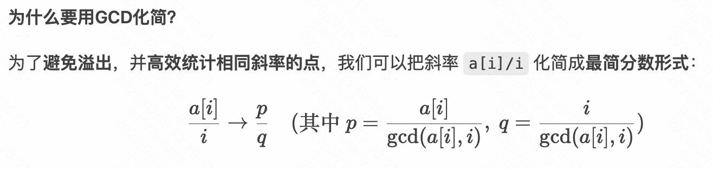

# 刷题

## LC - [670. 最大交换](https://leetcode.cn/problems/maximum-swap/) - 模拟

```java
class Solution {
    // 找到降序(非升序)结束后的最大值及其最大索引，并将其和降序(非升序)中小于该值的最小索引交换
    // 从 9 递减到 digits[i]+1看有没有某个数字 d > digits[i]，并且它的 last[d] 在 i 后面
    // 说明我们可以交换，让当前位变得更大 一旦找到，交换并立即返回结果（因为只允许交换一次）
    public int maximumSwap(int num) {
        char[] digits = Integer.toString(num).toCharArray();「转char」
        int n = digits.length;
        int[] last = new int[10]; // 记录每个数字最后出现的位置

        // 保证多次出现 是最后那个
        for (int i = 0; i < n; i++) {
            last[digits[i] - '0'] = i;
        }

        // 从左往右扫描每一位
        for (int i = 0; i < n; i++) {
            // 尝试从9到当前位+1寻找更大的数，交换
            for (int d = 9; d > digits[i] - '0'; d--) {
                if (last[d] > i) {
                    // 交换
                    char temp = digits[i];
                    digits[i] = digits[last[d]];
                    digits[last[d]] = temp;
                    return Integer.parseInt(new String(digits));「转Int」
                }
            }
        }

        return num;
    }
}
```

## [788. 旋转数字](https://leetcode.cn/problems/rotated-digits/) - 模拟

```java
class Solution {
    public int rotatedDigits(int n) {
        int ans = 0;
        out:for (int i = 1; i <= n; i++) {
            boolean ok = false;
            int x = i;
            while (x != 0) {
                int t = x % 10;
                x /= 10;
                // 每位数字逐个
                if (t == 2 || t == 5 || t == 6 || t == 9) ok = true;//会变（2569）- 好数
                else if (t == 3 && t == 4 && t == 7) continue out;//非有效翻转数（347）-则必然不是好数
            }
            if (ok) ans++;
        }
        return ans;
    }
}
```

## [319. 灯泡开关](https://leetcode.cn/problems/bulb-switcher/) - 数学 [672. 灯泡开关 Ⅱ](https://leetcode.cn/problems/bulb-switcher-ii/)


## [13. 罗马数字转整数](https://leetcode.cn/problems/roman-to-integer/) 、[12. 整数转罗马数字](https://leetcode.cn/problems/integer-to-roman/)

13：「S1：打表 二个优先级大」「S2hashmap存映射 、优化可用switch case

12：「S1：贪心 + 匹配」 「S2 数组范围有限 直接按每个数位 打表成数组 优化：static + sb拼接」


## 模拟 + 数学 — 最少steps to turn array into odd 


思路：全偶数 得找个一直 /2到1 最小操作那个 

有odd 其实就是合并次数 - 偶数数量

```java
import java.util.Scanner;

public class Main {
    public static void main(String[] args) {
        Scanner scanner = new Scanner(System.in);
        int t = scanner.nextInt(); // 测试用例数量

        while (t-- > 0) {
            int n = scanner.nextInt(); // 数列长度
            int[] nums = new int[n];   // 数列
            boolean hasOdd = false;    // 是否存在奇数
            int evenCount = 0;         // 偶数的数量
            int minBitLength = 32;     // 最小 bit_length（初始设为最大值）

            for (int i = 0; i < n; i++) {
                nums[i] = scanner.nextInt();
                if (nums[i] % 2 == 0) {
                    evenCount++;
                    int x = nums[i];
                    int cnt = 0;
                    // 计算 bit_length（二进制末尾的连续 0 的个数）
                    while (x % 2 == 0) {
                        cnt++;
                        x /= 2;
                    }
                    minBitLength = Math.min(minBitLength, cnt);
                } else {
                    hasOdd = true;
                }
            }

            // 分情况计算最少操作次数
            if (hasOdd) {
                System.out.println(evenCount);
            } else {
                System.out.println(evenCount + 「minBitLength - 1 steps turn into odd and 
                evenCount -1 actually);
            }
        }
        scanner.close();
    }
}
```

## 模拟 - 最短周期

小红有一个长度为n的字符串s，由0、1和 * 组成，可以把*替换成0或者1，小红想知道替换后的字符串的**最短周期是多少** 如果一个字符串每一个位置的字母都与后k位的字母相同，那么k即为该字符串的一个周期。

形式化的说，如果存在一个正整数k 使得对于所有的 i 属于[1,n - k] 都有 s[i]= s[i+k] ，那么称k是字符串s的周期。

<details class="lake-collapse"><summary id="u80209607"><span class="ne-text" style="color: black">输入</span></summary><p id="u557af0f2" class="ne-p" style="margin: 0; padding: 0; min-height: 24px"><span class="ne-text" style="color: black">输入描述  第一行输入一个长度为n(1&lt;=n&lt;=1e3)，且只由0、1和*组成的字符串s。</span></p><p id="u31dd961e" class="ne-p" style="margin: 0; padding: 0; min-height: 24px"><span class="ne-text" style="color: black">输出描述  在一行上输出一个整数，表示替换后的字符串的最短周期。</span></p><p id="u3022de58" class="ne-p" style="margin: 0; padding: 0; min-height: 24px"><span class="ne-text" style="color: black">示例1</span></p><p id="ub739ddcb" class="ne-p" style="margin: 0; padding: 0; min-height: 24px"><span class="ne-text" style="color: black">输入  1</span><em><span class="ne-text" style="color: black">011</span></em><span class="ne-text" style="color: black">0*1</span></p><p id="u8354f1c0" class="ne-p" style="margin: 0; padding: 0; min-height: 24px"><span class="ne-text" style="color: black">输出 4</span></p><p id="u40a2d3b4" class="ne-p" style="margin: 0; padding: 0; min-height: 24px"><span class="ne-text" style="color: black">说明 一共有六种替换方式，其中 100110011拥有最短周期。</span></p></details>

<details class="lake-collapse"><summary id="u22552630"><span class="ne-text" style="color: black">思路与代码</span></summary><p id="u74db5233" class="ne-p" style="margin: 0; padding: 0; min-height: 24px"><span class="ne-text" style="color: black">从1-n枚举周期，对于每一个周期</span><code class="ne-code" style="font-family: SFMono-Regular, Consolas, Liberation Mono, Menlo, Courier, monospace; background-color: rgba(0, 0, 0, 0.06); border: 1px solid rgba(0, 0, 0, 0.08); border-radius: 2px; padding: 0px 2px"><span class="ne-text" style="color: rgb(108, 158, 232); background-color: rgba(27, 31, 35, 0.05)">k</span></code><span class="ne-text" style="color: black">，将字符串分成多个</span><code class="ne-code" style="font-family: SFMono-Regular, Consolas, Liberation Mono, Menlo, Courier, monospace; background-color: rgba(0, 0, 0, 0.06); border: 1px solid rgba(0, 0, 0, 0.08); border-radius: 2px; padding: 0px 2px"><span class="ne-text" style="color: rgb(108, 158, 232); background-color: rgba(27, 31, 35, 0.05)">k</span></code><span class="ne-text" style="color: black">长度的部分，检查每一部分在相同位置上的字符是否可以相同。如果</span><code class="ne-code" style="font-family: SFMono-Regular, Consolas, Liberation Mono, Menlo, Courier, monospace; background-color: rgba(0, 0, 0, 0.06); border: 1px solid rgba(0, 0, 0, 0.08); border-radius: 2px; padding: 0px 2px"><span class="ne-text" style="color: rgb(108, 158, 232); background-color: rgba(27, 31, 35, 0.05)">k</span></code><span class="ne-text" style="color: black">可以作为周期，则记录最小的周期。</span></p><p id="u83489da8" class="ne-p" style="margin: 0; padding: 0; min-height: 24px"><span class="ne-text" style="color: black">「不是真的替换 * 就是万能」</span></p><p id="u739c1619" class="ne-p" style="margin: 0; padding: 0; min-height: 24px"><span class="ne-text" style="color: black"></span></p><p id="u28d9fd2b" class="ne-p" style="margin: 0; padding: 0; min-height: 24px"><span class="ne-text" style="color: black"></span></p><ul class="ne-ul" style="margin: 0; padding-left: 23px"><li id="u89cc8960" data-lake-index-type="0" style="text-align: left"><span class="ne-text" style="color: rgb(64, 64, 64)">组0 (</span><code class="ne-code" style="font-family: SFMono-Regular, Consolas, Liberation Mono, Menlo, Courier, monospace; background-color: rgba(0, 0, 0, 0.06); border: 1px solid rgba(0, 0, 0, 0.08); border-radius: 2px; padding: 0px 2px"><strong><span class="ne-text" style="color: rgb(64, 64, 64); background-color: rgb(236, 236, 236)">i % 2 == 0</span></strong></code><span class="ne-text" style="color: rgb(64, 64, 64)">): 位置 0, 2, 4 →</span><span class="ne-text" style="color: rgb(64, 64, 64)"> </span><code class="ne-code" style="font-family: SFMono-Regular, Consolas, Liberation Mono, Menlo, Courier, monospace; background-color: rgba(0, 0, 0, 0.06); border: 1px solid rgba(0, 0, 0, 0.08); border-radius: 2px; padding: 0px 2px"><strong><span class="ne-text" style="color: rgb(64, 64, 64); background-color: rgb(236, 236, 236)">s[0]='1'</span></strong></code><span class="ne-text" style="color: rgb(64, 64, 64)">,</span><span class="ne-text" style="color: rgb(64, 64, 64)"> </span><code class="ne-code" style="font-family: SFMono-Regular, Consolas, Liberation Mono, Menlo, Courier, monospace; background-color: rgba(0, 0, 0, 0.06); border: 1px solid rgba(0, 0, 0, 0.08); border-radius: 2px; padding: 0px 2px"><strong><span class="ne-text" style="color: rgb(64, 64, 64); background-color: rgb(236, 236, 236)">s[2]='1'</span></strong></code><span class="ne-text" style="color: rgb(64, 64, 64)">,</span><span class="ne-text" style="color: rgb(64, 64, 64)"> </span><code class="ne-code" style="font-family: SFMono-Regular, Consolas, Liberation Mono, Menlo, Courier, monospace; background-color: rgba(0, 0, 0, 0.06); border: 1px solid rgba(0, 0, 0, 0.08); border-radius: 2px; padding: 0px 2px"><strong><span class="ne-text" style="color: rgb(64, 64, 64); background-color: rgb(236, 236, 236)">s[4]='*'</span></strong></code><span class="ne-text" style="color: rgb(64, 64, 64)"> </span><span class="ne-text" style="color: rgb(64, 64, 64)">→ 组0的字符集合</span><span class="ne-text" style="color: rgb(64, 64, 64)"> </span><code class="ne-code" style="font-family: SFMono-Regular, Consolas, Liberation Mono, Menlo, Courier, monospace; background-color: rgba(0, 0, 0, 0.06); border: 1px solid rgba(0, 0, 0, 0.08); border-radius: 2px; padding: 0px 2px"><strong><span class="ne-text" style="color: rgb(64, 64, 64); background-color: rgb(236, 236, 236)">{'1'}</span></strong></code></li><li id="ud6a00150" data-lake-index-type="0" style="text-align: left"><span class="ne-text" style="color: rgb(64, 64, 64)">组1 (</span><code class="ne-code" style="font-family: SFMono-Regular, Consolas, Liberation Mono, Menlo, Courier, monospace; background-color: rgba(0, 0, 0, 0.06); border: 1px solid rgba(0, 0, 0, 0.08); border-radius: 2px; padding: 0px 2px"><strong><span class="ne-text" style="color: rgb(64, 64, 64); background-color: rgb(236, 236, 236)">i % 2 == 1</span></strong></code><span class="ne-text" style="color: rgb(64, 64, 64)">): 位置 1, 3, 5 → </span><code class="ne-code" style="font-family: SFMono-Regular, Consolas, Liberation Mono, Menlo, Courier, monospace; background-color: rgba(0, 0, 0, 0.06); border: 1px solid rgba(0, 0, 0, 0.08); border-radius: 2px; padding: 0px 2px"><strong><span class="ne-text" style="color: rgb(64, 64, 64); background-color: rgb(236, 236, 236)">s[1]='0'</span></strong></code><span class="ne-text" style="color: rgb(64, 64, 64)">, </span><code class="ne-code" style="font-family: SFMono-Regular, Consolas, Liberation Mono, Menlo, Courier, monospace; background-color: rgba(0, 0, 0, 0.06); border: 1px solid rgba(0, 0, 0, 0.08); border-radius: 2px; padding: 0px 2px"><strong><span class="ne-text" style="color: rgb(64, 64, 64); background-color: rgb(236, 236, 236)">s[3]='0'</span></strong></code><span class="ne-text" style="color: rgb(64, 64, 64)">, </span><code class="ne-code" style="font-family: SFMono-Regular, Consolas, Liberation Mono, Menlo, Courier, monospace; background-color: rgba(0, 0, 0, 0.06); border: 1px solid rgba(0, 0, 0, 0.08); border-radius: 2px; padding: 0px 2px"><strong><span class="ne-text" style="color: rgb(64, 64, 64); background-color: rgb(236, 236, 236)">s[5]='1'</span></strong></code><span class="ne-text" style="color: rgb(64, 64, 64)"> → 组1的字符集合 </span><code class="ne-code" style="font-family: SFMono-Regular, Consolas, Liberation Mono, Menlo, Courier, monospace; background-color: rgba(0, 0, 0, 0.06); border: 1px solid rgba(0, 0, 0, 0.08); border-radius: 2px; padding: 0px 2px"><strong><span class="ne-text" style="color: rgb(64, 64, 64); background-color: rgb(236, 236, 236)">{'0', '1'}</span></strong></code></li></ul><p id="u1d148b76" class="ne-p" style="margin: 0; padding: 0; min-height: 24px; text-align: left"><strong><span class="ne-text" style="color: rgb(64, 64, 64); background-color: rgb(236, 236, 236)"></span></strong></p><ul class="ne-ul" style="margin: 0; padding-left: 23px"><li id="u04dc37ab" data-lake-index-type="0"><span class="ne-text" style="color: rgb(64, 64, 64)">尝试 </span><code class="ne-code" style="font-family: SFMono-Regular, Consolas, Liberation Mono, Menlo, Courier, monospace; background-color: rgba(0, 0, 0, 0.06); border: 1px solid rgba(0, 0, 0, 0.08); border-radius: 2px; padding: 0px 2px"><strong><span class="ne-text" style="color: rgb(64, 64, 64); background-color: rgb(236, 236, 236)">k = 1</span></strong></code><span class="ne-text" style="color: rgb(64, 64, 64)">：</span></li></ul><ul class="ne-list-wrap" style="margin: 0; padding-left: 23px; list-style: none"><ul ne-level="1" class="ne-ul" style="margin: 0; padding-left: 23px; list-style: circle"><li id="u67f86657" data-lake-index-type="0"><span class="ne-text" style="color: rgb(64, 64, 64)">分组：</span><code class="ne-code" style="font-family: SFMono-Regular, Consolas, Liberation Mono, Menlo, Courier, monospace; background-color: rgba(0, 0, 0, 0.06); border: 1px solid rgba(0, 0, 0, 0.08); border-radius: 2px; padding: 0px 2px"><strong><span class="ne-text" style="color: rgb(64, 64, 64); background-color: rgb(236, 236, 236)">g[0] = {'1', '0', '1'}</span></strong></code><span class="ne-text" style="color: rgb(64, 64, 64)">（因为</span><span class="ne-text" style="color: rgb(64, 64, 64)"> </span><code class="ne-code" style="font-family: SFMono-Regular, Consolas, Liberation Mono, Menlo, Courier, monospace; background-color: rgba(0, 0, 0, 0.06); border: 1px solid rgba(0, 0, 0, 0.08); border-radius: 2px; padding: 0px 2px"><strong><span class="ne-text" style="color: rgb(64, 64, 64); background-color: rgb(236, 236, 236)">s[0]='1'</span></strong></code><span class="ne-text" style="color: rgb(64, 64, 64)">,</span><span class="ne-text" style="color: rgb(64, 64, 64)"> </span><code class="ne-code" style="font-family: SFMono-Regular, Consolas, Liberation Mono, Menlo, Courier, monospace; background-color: rgba(0, 0, 0, 0.06); border: 1px solid rgba(0, 0, 0, 0.08); border-radius: 2px; padding: 0px 2px"><strong><span class="ne-text" style="color: rgb(64, 64, 64); background-color: rgb(236, 236, 236)">s[1]='0'</span></strong></code><span class="ne-text" style="color: rgb(64, 64, 64)">,</span><span class="ne-text" style="color: rgb(64, 64, 64)"> </span><code class="ne-code" style="font-family: SFMono-Regular, Consolas, Liberation Mono, Menlo, Courier, monospace; background-color: rgba(0, 0, 0, 0.06); border: 1px solid rgba(0, 0, 0, 0.08); border-radius: 2px; padding: 0px 2px"><strong><span class="ne-text" style="color: rgb(64, 64, 64); background-color: rgb(236, 236, 236)">s[2]='1'</span></strong></code><span class="ne-text" style="color: rgb(64, 64, 64)">, ...）</span></li><li id="ud8d1c38e" data-lake-index-type="0"><code class="ne-code" style="font-family: SFMono-Regular, Consolas, Liberation Mono, Menlo, Courier, monospace; background-color: rgba(0, 0, 0, 0.06); border: 1px solid rgba(0, 0, 0, 0.08); border-radius: 2px; padding: 0px 2px"><strong><span class="ne-text" style="color: rgb(64, 64, 64); background-color: rgb(236, 236, 236)">g[0]</span></strong></code><span class="ne-text" style="color: rgb(64, 64, 64)"> </span><span class="ne-text" style="color: rgb(64, 64, 64)">包含</span><span class="ne-text" style="color: rgb(64, 64, 64)"> </span><code class="ne-code" style="font-family: SFMono-Regular, Consolas, Liberation Mono, Menlo, Courier, monospace; background-color: rgba(0, 0, 0, 0.06); border: 1px solid rgba(0, 0, 0, 0.08); border-radius: 2px; padding: 0px 2px"><strong><span class="ne-text" style="color: rgb(64, 64, 64); background-color: rgb(236, 236, 236)">'0'</span></strong></code><span class="ne-text" style="color: rgb(64, 64, 64)"> </span><span class="ne-text" style="color: rgb(64, 64, 64)">和</span><span class="ne-text" style="color: rgb(64, 64, 64)"> </span><code class="ne-code" style="font-family: SFMono-Regular, Consolas, Liberation Mono, Menlo, Courier, monospace; background-color: rgba(0, 0, 0, 0.06); border: 1px solid rgba(0, 0, 0, 0.08); border-radius: 2px; padding: 0px 2px"><strong><span class="ne-text" style="color: rgb(64, 64, 64); background-color: rgb(236, 236, 236)">'1'</span></strong></code><span class="ne-text" style="color: rgb(64, 64, 64)">，所以</span><span class="ne-text" style="color: rgb(64, 64, 64)"> </span><code class="ne-code" style="font-family: SFMono-Regular, Consolas, Liberation Mono, Menlo, Courier, monospace; background-color: rgba(0, 0, 0, 0.06); border: 1px solid rgba(0, 0, 0, 0.08); border-radius: 2px; padding: 0px 2px"><strong><span class="ne-text" style="color: rgb(64, 64, 64); background-color: rgb(236, 236, 236)">k=1</span></strong></code><span class="ne-text" style="color: rgb(64, 64, 64)"> </span><span class="ne-text" style="color: rgb(64, 64, 64)">不可行。</span></li></ul></ul><ul class="ne-ul" style="margin: 0; padding-left: 23px"><li id="u98e7ad37" data-lake-index-type="0"><span class="ne-text" style="color: rgb(64, 64, 64)">尝试</span><span class="ne-text" style="color: rgb(64, 64, 64)"> </span><code class="ne-code" style="font-family: SFMono-Regular, Consolas, Liberation Mono, Menlo, Courier, monospace; background-color: rgba(0, 0, 0, 0.06); border: 1px solid rgba(0, 0, 0, 0.08); border-radius: 2px; padding: 0px 2px"><strong><span class="ne-text" style="color: rgb(64, 64, 64); background-color: rgb(236, 236, 236)">k = 2</span></strong></code><span class="ne-text" style="color: rgb(64, 64, 64)">：</span></li></ul><ul class="ne-list-wrap" style="margin: 0; padding-left: 23px; list-style: none"><ul ne-level="1" class="ne-ul" style="margin: 0; padding-left: 23px; list-style: circle"><li id="ue6cc193d" data-lake-index-type="0"><span class="ne-text" style="color: rgb(64, 64, 64)">分组：</span></li></ul></ul><ul class="ne-list-wrap" style="margin: 0; padding-left: 23px; list-style: none"><ul class="ne-list-wrap" style="margin: 0; padding-left: 23px; list-style: none"><ul ne-level="2" class="ne-ul" style="margin: 0; padding-left: 23px; list-style: square"><li id="u78f38e8e" data-lake-index-type="0"><code class="ne-code" style="font-family: SFMono-Regular, Consolas, Liberation Mono, Menlo, Courier, monospace; background-color: rgba(0, 0, 0, 0.06); border: 1px solid rgba(0, 0, 0, 0.08); border-radius: 2px; padding: 0px 2px"><strong><span class="ne-text" style="color: rgb(64, 64, 64); background-color: rgb(236, 236, 236)">g[0] = {s[0], s[2], s[4]} = {'1', '1', '*'}</span></strong></code><span class="ne-text" style="color: rgb(64, 64, 64)"> </span><span class="ne-text" style="color: rgb(64, 64, 64)">→</span><span class="ne-text" style="color: rgb(64, 64, 64)"> </span><code class="ne-code" style="font-family: SFMono-Regular, Consolas, Liberation Mono, Menlo, Courier, monospace; background-color: rgba(0, 0, 0, 0.06); border: 1px solid rgba(0, 0, 0, 0.08); border-radius: 2px; padding: 0px 2px"><strong><span class="ne-text" style="color: rgb(64, 64, 64); background-color: rgb(236, 236, 236)">{'1'}</span></strong></code></li><li id="u4af2106e" data-lake-index-type="0"><code class="ne-code" style="font-family: SFMono-Regular, Consolas, Liberation Mono, Menlo, Courier, monospace; background-color: rgba(0, 0, 0, 0.06); border: 1px solid rgba(0, 0, 0, 0.08); border-radius: 2px; padding: 0px 2px"><strong><span class="ne-text" style="color: rgb(64, 64, 64); background-color: rgb(236, 236, 236)">g[1] = {s[1], s[3], s[5]} = {'0', '0', '1'}</span></strong></code><span class="ne-text" style="color: rgb(64, 64, 64)"> </span><span class="ne-text" style="color: rgb(64, 64, 64)">→</span><span class="ne-text" style="color: rgb(64, 64, 64)"> </span><code class="ne-code" style="font-family: SFMono-Regular, Consolas, Liberation Mono, Menlo, Courier, monospace; background-color: rgba(0, 0, 0, 0.06); border: 1px solid rgba(0, 0, 0, 0.08); border-radius: 2px; padding: 0px 2px"><strong><span class="ne-text" style="color: rgb(64, 64, 64); background-color: rgb(236, 236, 236)">{'0', '1'}</span></strong></code></li></ul></ul></ul><ul class="ne-list-wrap" style="margin: 0; padding-left: 23px; list-style: none"><ul ne-level="1" class="ne-ul" style="margin: 0; padding-left: 23px; list-style: circle"><li id="uf866dac5" data-lake-index-type="0"><code class="ne-code" style="font-family: SFMono-Regular, Consolas, Liberation Mono, Menlo, Courier, monospace; background-color: rgba(0, 0, 0, 0.06); border: 1px solid rgba(0, 0, 0, 0.08); border-radius: 2px; padding: 0px 2px"><strong><span class="ne-text" style="color: rgb(64, 64, 64); background-color: rgb(236, 236, 236)">g[1]</span></strong></code><span class="ne-text" style="color: rgb(64, 64, 64)"> </span><span class="ne-text" style="color: rgb(64, 64, 64)">包含</span><span class="ne-text" style="color: rgb(64, 64, 64)"> </span><code class="ne-code" style="font-family: SFMono-Regular, Consolas, Liberation Mono, Menlo, Courier, monospace; background-color: rgba(0, 0, 0, 0.06); border: 1px solid rgba(0, 0, 0, 0.08); border-radius: 2px; padding: 0px 2px"><strong><span class="ne-text" style="color: rgb(64, 64, 64); background-color: rgb(236, 236, 236)">'0'</span></strong></code><span class="ne-text" style="color: rgb(64, 64, 64)"> </span><span class="ne-text" style="color: rgb(64, 64, 64)">和</span><span class="ne-text" style="color: rgb(64, 64, 64)"> </span><code class="ne-code" style="font-family: SFMono-Regular, Consolas, Liberation Mono, Menlo, Courier, monospace; background-color: rgba(0, 0, 0, 0.06); border: 1px solid rgba(0, 0, 0, 0.08); border-radius: 2px; padding: 0px 2px"><strong><span class="ne-text" style="color: rgb(64, 64, 64); background-color: rgb(236, 236, 236)">'1'</span></strong></code><span class="ne-text" style="color: rgb(64, 64, 64)">，所以</span><span class="ne-text" style="color: rgb(64, 64, 64)"> </span><code class="ne-code" style="font-family: SFMono-Regular, Consolas, Liberation Mono, Menlo, Courier, monospace; background-color: rgba(0, 0, 0, 0.06); border: 1px solid rgba(0, 0, 0, 0.08); border-radius: 2px; padding: 0px 2px"><strong><span class="ne-text" style="color: rgb(64, 64, 64); background-color: rgb(236, 236, 236)">k=2</span></strong></code><span class="ne-text" style="color: rgb(64, 64, 64)"> </span><span class="ne-text" style="color: rgb(64, 64, 64)">不可行。</span></li></ul></ul><ul class="ne-ul" style="margin: 0; padding-left: 23px"><li id="u04c651a0" data-lake-index-type="0"><span class="ne-text" style="color: rgb(64, 64, 64)">尝试</span><span class="ne-text" style="color: rgb(64, 64, 64)"> </span><code class="ne-code" style="font-family: SFMono-Regular, Consolas, Liberation Mono, Menlo, Courier, monospace; background-color: rgba(0, 0, 0, 0.06); border: 1px solid rgba(0, 0, 0, 0.08); border-radius: 2px; padding: 0px 2px"><strong><span class="ne-text" style="color: rgb(64, 64, 64); background-color: rgb(236, 236, 236)">k = 3</span></strong></code><span class="ne-text" style="color: rgb(64, 64, 64)">：</span></li></ul><ul class="ne-list-wrap" style="margin: 0; padding-left: 23px; list-style: none"><ul ne-level="1" class="ne-ul" style="margin: 0; padding-left: 23px; list-style: circle"><li id="u1a5346d3" data-lake-index-type="0"><span class="ne-text" style="color: rgb(64, 64, 64)">分组：</span></li></ul></ul><ul class="ne-list-wrap" style="margin: 0; padding-left: 23px; list-style: none"><ul class="ne-list-wrap" style="margin: 0; padding-left: 23px; list-style: none"><ul ne-level="2" class="ne-ul" style="margin: 0; padding-left: 23px; list-style: square"><li id="uad6ec1b2" data-lake-index-type="0"><code class="ne-code" style="font-family: SFMono-Regular, Consolas, Liberation Mono, Menlo, Courier, monospace; background-color: rgba(0, 0, 0, 0.06); border: 1px solid rgba(0, 0, 0, 0.08); border-radius: 2px; padding: 0px 2px"><strong><span class="ne-text" style="color: rgb(64, 64, 64); background-color: rgb(236, 236, 236)">g[0] = {s[0], s[3], s[6]} = {'1', '0', '1'}</span></strong></code><span class="ne-text" style="color: rgb(64, 64, 64)"> </span><span class="ne-text" style="color: rgb(64, 64, 64)">→</span><span class="ne-text" style="color: rgb(64, 64, 64)"> </span><code class="ne-code" style="font-family: SFMono-Regular, Consolas, Liberation Mono, Menlo, Courier, monospace; background-color: rgba(0, 0, 0, 0.06); border: 1px solid rgba(0, 0, 0, 0.08); border-radius: 2px; padding: 0px 2px"><strong><span class="ne-text" style="color: rgb(64, 64, 64); background-color: rgb(236, 236, 236)">{'0', '1'}</span></strong></code></li><li id="u271462d3" data-lake-index-type="0"><code class="ne-code" style="font-family: SFMono-Regular, Consolas, Liberation Mono, Menlo, Courier, monospace; background-color: rgba(0, 0, 0, 0.06); border: 1px solid rgba(0, 0, 0, 0.08); border-radius: 2px; padding: 0px 2px"><strong><span class="ne-text" style="color: rgb(64, 64, 64); background-color: rgb(236, 236, 236)">g[1] = {s[1], s[4]} = {'0', '*'}</span></strong></code><span class="ne-text" style="color: rgb(64, 64, 64)"> </span><span class="ne-text" style="color: rgb(64, 64, 64)">→</span><span class="ne-text" style="color: rgb(64, 64, 64)"> </span><code class="ne-code" style="font-family: SFMono-Regular, Consolas, Liberation Mono, Menlo, Courier, monospace; background-color: rgba(0, 0, 0, 0.06); border: 1px solid rgba(0, 0, 0, 0.08); border-radius: 2px; padding: 0px 2px"><strong><span class="ne-text" style="color: rgb(64, 64, 64); background-color: rgb(236, 236, 236)">{'0'}</span></strong></code></li><li id="u4d9b6471" data-lake-index-type="0"><code class="ne-code" style="font-family: SFMono-Regular, Consolas, Liberation Mono, Menlo, Courier, monospace; background-color: rgba(0, 0, 0, 0.06); border: 1px solid rgba(0, 0, 0, 0.08); border-radius: 2px; padding: 0px 2px"><strong><span class="ne-text" style="color: rgb(64, 64, 64); background-color: rgb(236, 236, 236)">g[2] = {s[2], s[5]} = {'1', '1'}</span></strong></code><span class="ne-text" style="color: rgb(64, 64, 64)"> </span><span class="ne-text" style="color: rgb(64, 64, 64)">→</span><span class="ne-text" style="color: rgb(64, 64, 64)"> </span><code class="ne-code" style="font-family: SFMono-Regular, Consolas, Liberation Mono, Menlo, Courier, monospace; background-color: rgba(0, 0, 0, 0.06); border: 1px solid rgba(0, 0, 0, 0.08); border-radius: 2px; padding: 0px 2px"><strong><span class="ne-text" style="color: rgb(64, 64, 64); background-color: rgb(236, 236, 236)">{'1'}</span></strong></code></li></ul></ul></ul><ul class="ne-list-wrap" style="margin: 0; padding-left: 23px; list-style: none"><ul ne-level="1" class="ne-ul" style="margin: 0; padding-left: 23px; list-style: circle"><li id="uecd35bc3" data-lake-index-type="0"><code class="ne-code" style="font-family: SFMono-Regular, Consolas, Liberation Mono, Menlo, Courier, monospace; background-color: rgba(0, 0, 0, 0.06); border: 1px solid rgba(0, 0, 0, 0.08); border-radius: 2px; padding: 0px 2px"><strong><span class="ne-text" style="color: rgb(64, 64, 64); background-color: rgb(236, 236, 236)">g[0]</span></strong></code><span class="ne-text" style="color: rgb(64, 64, 64)"> 包含 </span><code class="ne-code" style="font-family: SFMono-Regular, Consolas, Liberation Mono, Menlo, Courier, monospace; background-color: rgba(0, 0, 0, 0.06); border: 1px solid rgba(0, 0, 0, 0.08); border-radius: 2px; padding: 0px 2px"><strong><span class="ne-text" style="color: rgb(64, 64, 64); background-color: rgb(236, 236, 236)">'0'</span></strong></code><span class="ne-text" style="color: rgb(64, 64, 64)"> 和 </span><code class="ne-code" style="font-family: SFMono-Regular, Consolas, Liberation Mono, Menlo, Courier, monospace; background-color: rgba(0, 0, 0, 0.06); border: 1px solid rgba(0, 0, 0, 0.08); border-radius: 2px; padding: 0px 2px"><strong><span class="ne-text" style="color: rgb(64, 64, 64); background-color: rgb(236, 236, 236)">'1'</span></strong></code><span class="ne-text" style="color: rgb(64, 64, 64)">，所以 </span><code class="ne-code" style="font-family: SFMono-Regular, Consolas, Liberation Mono, Menlo, Courier, monospace; background-color: rgba(0, 0, 0, 0.06); border: 1px solid rgba(0, 0, 0, 0.08); border-radius: 2px; padding: 0px 2px"><strong><span class="ne-text" style="color: rgb(64, 64, 64); background-color: rgb(236, 236, 236)">k=3</span></strong></code><span class="ne-text" style="color: rgb(64, 64, 64)"> 不可行。</span></li></ul></ul></details>

```java
public class Main {
    public static void main(String[] args) {
        Scanner scanner = new Scanner(System.in);
        String s = scanner.nextLine().trim();
        int result = getShortestPeriod(s);
        System.out.println(result);
    }

    public static int getShortestPeriod(String s) {
        int n = s.length();
        
        // 从最小可能的周期1开始尝试
        for (int k = 1; k <= n; k++) {
            // 用于存储每个组中的字符
            Set<Character>[] groups = new HashSet[k];
            for (int i = 0; i < k; i++) {
                groups[i] = new HashSet<>();
            }
            
            // 遍历字符串，将字符分配到对应的组
            for (int i = 0; i < n; i++) {
                char c = s.charAt(i);
                if (c != '*') {
                    groups[i % k].add(c);
                }
            }
            
            // 检查所有组是否满足条件
            boolean valid = true;
            for (Set<Character> group : groups) {
                // 如果某个组同时包含0和1，则这个k不可能是周期
                if (group.size() >= 2) {
                    valid = false;
                    break;
                }
            }
            
            // 如果当前k满足条件，直接返回（因为是从小到大检查的）
            if (valid) {
                return k;
            }
        }
        
        // 如果没有找到更小的周期，返回字符串长度（周期为n）
        return n;
    }
}
```

## 模拟 + 直线斜率 

题目描述

二维平面上有几 个整点 a[1],a[2],·..,a[n]，其中第个点的坐标为(i,a[i])。

小苯想知道有多少个点对 , （`**i < j**`）j 满足第i个点和第j个点的连线所在的直线恰好经过原点，请你帮他算一算吧。

<details class="lake-collapse"><summary id="u0e0e2d99"></summary><h4 id="ym4F1" style="font-size: 16px; line-height: 24px; margin: 10px 0 5px 0"><strong><span class="ne-text" style="color: black">输入描述</span></strong></h4><p id="u9e427ec9" class="ne-p" style="margin: 0; padding: 0; min-height: 24px"><span class="ne-text" style="color: black">第一行输入一个正整数n(2 &lt;= n &lt; =2e5)代表整点数量。第二行输入n个正整数 a[1],a[2],·..,a[n]](1 &lt;= a[i]&lt; 1e9)代表整点的纵坐标。</span></p><h4 id="oToAB" style="font-size: 16px; line-height: 24px; margin: 10px 0 5px 0"><strong><span class="ne-text" style="color: black">输出描述</span></strong></h4><p id="u80db7b88" class="ne-p" style="margin: 0; padding: 0; min-height: 24px"><span class="ne-text" style="color: black">在一行上输出一个正整数，表示连线所在直线经过原点的点对个数。</span></p><h4 id="pRhbs" style="font-size: 16px; line-height: 24px; margin: 10px 0 5px 0"><strong><span class="ne-text" style="color: black">示例1</span></strong></h4><h4 id="JY843" style="font-size: 16px; line-height: 24px; margin: 10px 0 5px 0"><strong><span class="ne-text" style="color: black">输入</span></strong></h4><pre data-language="plain" id="I7mJ9" class="ne-codeblock language-plain" style="border: 1px solid #e8e8e8; border-radius: 2px; background: #f9f9f9; padding: 16px; font-size: 13px; color: #595959"><code>5
1 2 4 4 5</code></pre><h4 id="KYmaE" style="font-size: 16px; line-height: 24px; margin: 10px 0 5px 0"><strong><span class="ne-text" style="color: black">输出</span></strong></h4><p id="u73538729" class="ne-p" style="margin: 0; padding: 0; min-height: 24px"><span class="ne-text">6</span></p></details>

思路：

两点 `**(i, a[i])**` 和 `**(j, a[j])**` 的连线经过原点，当且仅当它们的斜率相同 

a[i]/i == a[j]/j 、为了避免浮点数精度问题，可以交叉相乘得到 a[i] * j == a[j] * i

But 会有溢出可能 2e5*1e9 = 2e14

法1：Int：2×10^9 long:9×10^18 这里改long可以 or 

法2：最简分数




题目中 n≤2×105，双重循环的时间复杂度是 O(n2)=4×1010，远超时间限制（通常 108 次操作是极限）


数学组合：用哈希表统计斜率出现的次数，然后计算组合数 C(m,2)=m(m−1)/2 其实就是两两配对